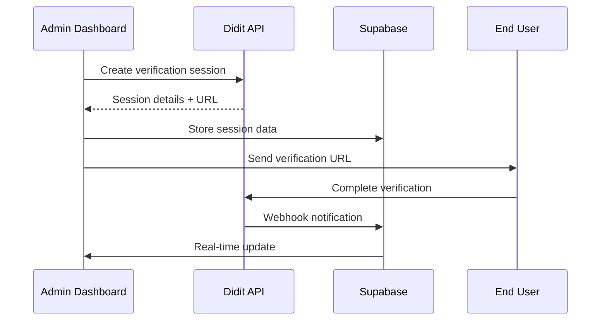
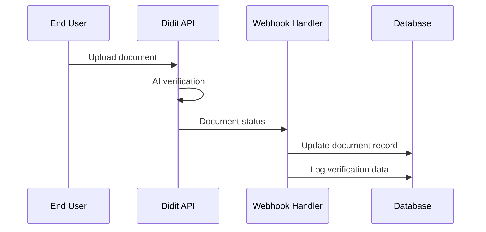
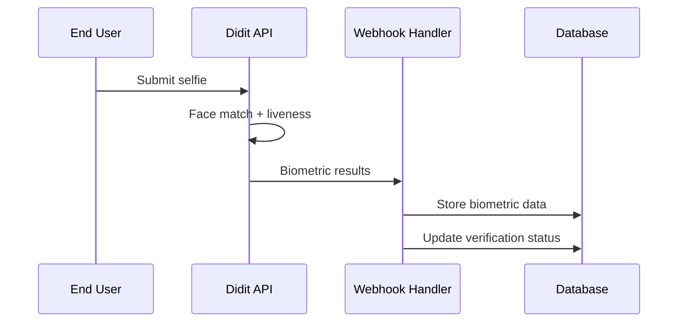

# Didit API Integration Documentation

## Overview

This document provides comprehensive documentation for the secure integration between DRONERA's KYC Management system and the Didit.me identity verification API.

## Architecture

### System Components

1. **Frontend Integration** (`src/lib/diditAPI.ts`)
   - Secure API client with authentication
   - Real-time status monitoring
   - Performance tracking
   - Error handling and retry logic

2. **Database Schema** (`supabase/migrations/`)
   - Enhanced KYC verification tables
   - Didit-specific session management
   - Document and biometric tracking
   - Comprehensive audit logging

3. **Webhook Handler** (`supabase/functions/didit-webhook/`)
   - Real-time status updates
   - Secure payload verification
   - Automated status processing
   - Error recovery mechanisms

## API Endpoints

### Authentication
```typescript
POST /auth/token
Headers: X-API-Key: {DIDIT_API_KEY}
Body: {
  grant_type: "client_credentials",
  scope: "verification:read verification:write documents:read biometrics:read"
}
```

### Create Verification Session
```typescript
POST /verification/sessions
Headers: Authorization: Bearer {token}
Body: {
  userId: string,
  email: string,
  redirectUrl: string,
  webhookUrl: string,
  verificationType: "full_kyc",
  requiredDocuments: ["identity_document", "proof_of_address", "selfie"],
  biometricRequirements: {
    faceMatch: true,
    livenessCheck: true
  },
  complianceChecks: {
    amlScreening: true,
    sanctionsCheck: true,
    pepCheck: true
  }
}
```

### Get Verification Status
```typescript
GET /verification/sessions/{sessionId}
Headers: Authorization: Bearer {token}
```

### Download Document
```typescript
GET /verification/sessions/{sessionId}/documents/{documentId}/download
Headers: Authorization: Bearer {token}
```

## Data Flow

### 1. Verification Initiation


### 2. Document Processing


### 3. Biometric Verification


## Security Measures

### 1. Data Encryption
- **In Transit**: TLS 1.3 for all API communications
- **At Rest**: AES-256 encryption for sensitive data
- **Client-Side**: Secure session storage with encryption

### 2. Authentication & Authorization
- **API Authentication**: Bearer token with automatic refresh
- **Webhook Verification**: HMAC signature validation
- **Role-Based Access**: Admin-only access to sensitive operations

### 3. Audit Logging
```typescript
interface AuditLog {
  action: string;
  description: string;
  metadata: object;
  sessionId?: string;
  responseTime?: number;
  ipAddress: string;
  userAgent: string;
  timestamp: string;
}
```

### 4. Rate Limiting
- **API Calls**: 100 requests per minute per session
- **Document Downloads**: 10 downloads per minute per admin
- **Webhook Processing**: Exponential backoff on failures

## Performance Monitoring

### Key Metrics Tracked
1. **API Response Times**
   - Authentication: < 500ms
   - Session Creation: < 2s
   - Status Checks: < 1s
   - Document Downloads: < 5s

2. **Success Rates**
   - API Calls: > 99.5%
   - Webhook Processing: > 99.9%
   - Document Verification: > 95%

3. **System Health**
   - Database Connection Pool
   - Memory Usage
   - Error Rates
   - Queue Depths

### Performance Dashboard
```typescript
interface PerformanceMetrics {
  totalApiCalls: number;
  averageResponseTime: number;
  successRate: number;
  callsByAction: Record<string, number>;
  last24hCalls: number;
}
```

## Error Handling

### 1. API Errors
```typescript
interface APIError {
  code: string;
  message: string;
  details?: object;
  retryable: boolean;
}
```

### 2. Retry Strategy
- **Exponential Backoff**: 1s, 2s, 4s, 8s, 16s
- **Max Retries**: 5 attempts
- **Circuit Breaker**: Fail fast after 10 consecutive failures

### 3. Fallback Mechanisms
- **Cached Data**: Use last known status during API outages
- **Manual Override**: Admin can manually approve/decline
- **Offline Mode**: Queue operations for later processing

## Compliance & Regulations

### 1. Data Protection (GDPR)
- **Data Minimization**: Only collect necessary information
- **Purpose Limitation**: Use data only for KYC verification
- **Storage Limitation**: Automatic deletion after retention period
- **User Rights**: Access, rectification, erasure, portability

### 2. Financial Regulations
- **AML Compliance**: Automated screening against sanctions lists
- **KYC Requirements**: Identity, address, and source of funds verification
- **Record Keeping**: 5-year retention of verification records
- **Reporting**: Suspicious activity monitoring and reporting

### 3. Security Standards
- **ISO 27001**: Information security management
- **SOC 2 Type II**: Security, availability, and confidentiality
- **PCI DSS**: Payment card industry compliance (if applicable)

## Testing & Validation

### 1. Unit Tests
```bash
# Run API integration tests
npm run test:didit-api

# Run webhook handler tests
npm run test:webhooks

# Run performance tests
npm run test:performance
```

### 2. Integration Tests
- **End-to-End Verification**: Complete user journey
- **Webhook Processing**: All event types and edge cases
- **Error Scenarios**: Network failures, invalid data, timeouts

### 3. Load Testing
- **Concurrent Sessions**: 100 simultaneous verifications
- **Document Processing**: 1000 documents per hour
- **Webhook Throughput**: 500 webhooks per minute

## Deployment & Operations

### 1. Environment Configuration
```bash
# Required environment variables
DIDIT_API_KEY=your_api_key_here
DIDIT_WEBHOOK_SECRET=your_webhook_secret_here
SUPABASE_URL=your_supabase_url
SUPABASE_SERVICE_ROLE_KEY=your_service_role_key
```

### 2. Monitoring & Alerting
- **API Health Checks**: Every 30 seconds
- **Error Rate Alerts**: > 1% error rate
- **Performance Alerts**: > 5s response time
- **Webhook Failures**: Immediate notification

### 3. Backup & Recovery
- **Database Backups**: Daily automated backups
- **Configuration Backups**: Version-controlled settings
- **Disaster Recovery**: 4-hour RTO, 1-hour RPO

## Support & Maintenance

### 1. Documentation Updates
- **API Changes**: Update within 24 hours
- **Security Patches**: Immediate documentation
- **Feature Additions**: Complete documentation before release

### 2. Support Channels
- **Technical Issues**: support@dronera.com
- **Security Concerns**: security@dronera.com
- **Emergency Contact**: +1-XXX-XXX-XXXX (24/7)

### 3. Maintenance Windows
- **Scheduled Maintenance**: Sundays 2-4 AM UTC
- **Emergency Patches**: As needed with 1-hour notice
- **Version Updates**: Monthly release cycle

## Conclusion

This integration provides a secure, scalable, and compliant identity verification system that meets the highest standards for financial services. The comprehensive monitoring, error handling, and security measures ensure reliable operation while maintaining user privacy and regulatory compliance.

For technical support or questions about this integration, please contact the DRONERA development team.